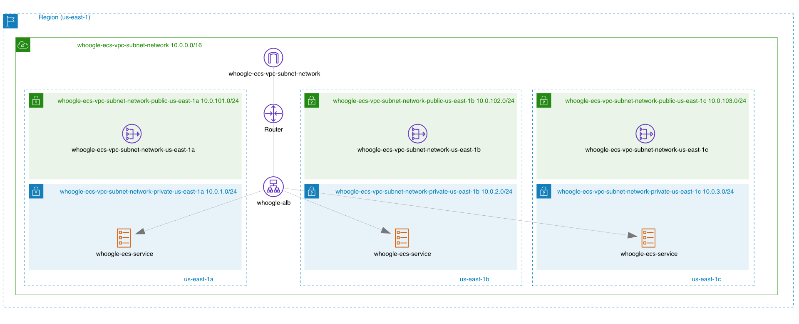

# YAWI - Yet Another Whoogle Instance

## AWS-22-3 Capstone Project

#### Containerized and high available Whoogle Search Engine Instance.

[Whoogle Search](https://github.com/benbusby/whoogle-search):
Get Google search results, but without any ads, javascript, AMP links, cookies, or IP address tracking. Easily deployable in one click as a Docker app, and customizable with a single config file. Quick and simple to implement as a primary search engine replacement on both desktop and mobile.

This is the infrastructure for a Whoogle Search Instance to learn autoscaling and testing AWS Infrastructure

**Tools** (so far)
- Docker
- Git
- Github Actions
- Terraform
- AWS
  - VPC
  - Aplication Loadbalancing
  - ECS Fargate
- Stress Tests
  - [cypress](https://www.cypress.io/)

  #### Infrastructure 2022-12-06

  
