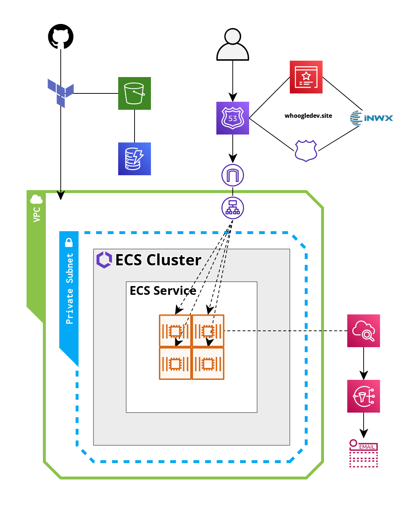
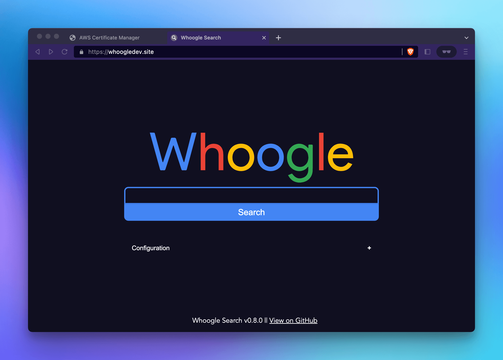
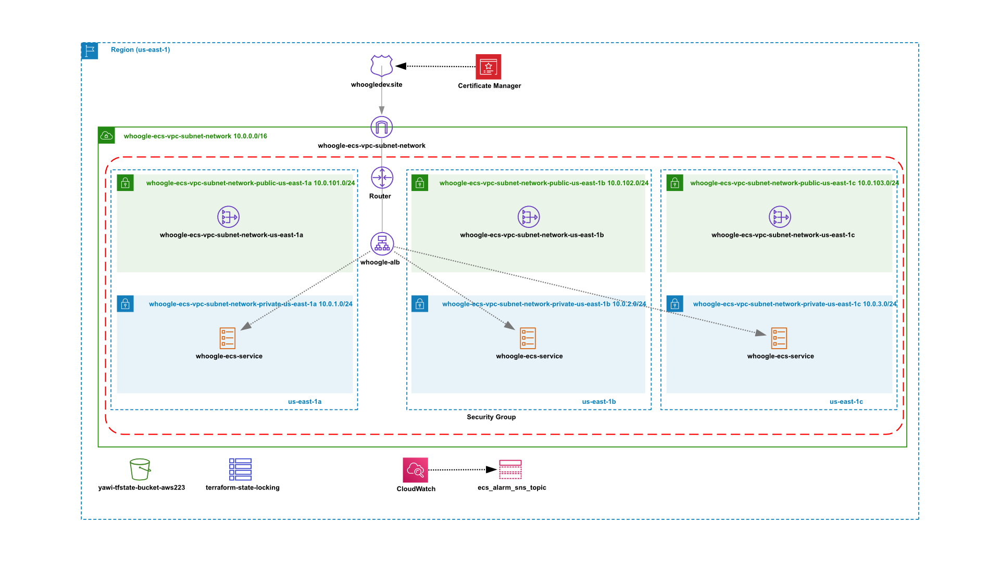

# YAWI - Yet Another Whoogle Instance

## AWS-22-3 Capstone Project

#### Containerized and high available Whoogle Search Engine Instance.

##### ⚠️ Attention: Do not use in production. Only for learning and testing. Work in progress.

#### What is Whoogle Search?

[Whoogle Search](https://github.com/benbusby/whoogle-search):
Get Google search results, but without any ads, javascript, AMP links, cookies, or IP address tracking. Easily deployable in one click as a Docker app, and customizable with a single config file. Quick and simple to implement as a primary search engine replacement on both desktop and mobile.

#### Goal:

Use Terraform and Github Actions to start
an autoscaling high-available ECS Fargate Cluster,
set up DNS and TLS with Route 53 and AWS Certificate Manager.

#### Tools:

- Docker
- Git
- Github Actions
- Terraform
- AWS
  - VPC
  - Aplication Loadbalancing
  - ECS Fargate
  - Route 53
  - AWS Certificate Manager
  - Cloudwatch
  - SNS
  - S3
  - DynamoDB
  
#### Final Infrastructure simplyfied:

#### How to:

After the first run uncomment the following parts:
**terraform/route53.tf** from line 12
**terraform/loadbalancer.tf** line 42 to 49 and line 64 to line 77 and comment out line 54 to 57
**terraform/providers.tf** line 6 to 12

Get the NS Records from Route 53 Hosted Zones and apply
them as external Nameserver in your DNS Settings at your Domain Provider.

Run terraform apply again.

#### Result:

#### Infrastructure 2022-12-12:

